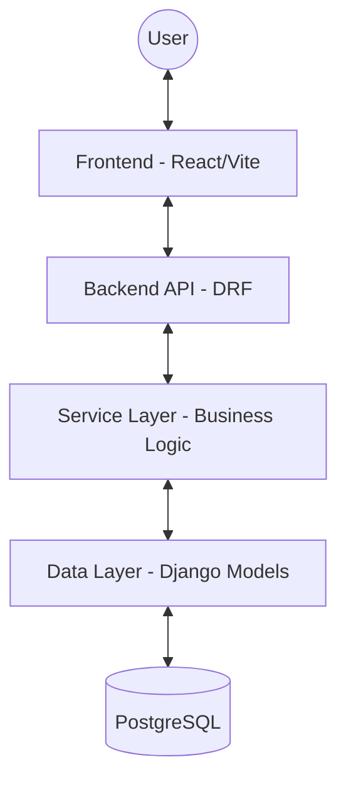

# Project Architecture

This document provides a high-level overview of the project's architecture to help developers and AI agents understand how the system is structured.

## System Overview

The project is a monolith application with a Django/DRF backend and a React/Vite frontend.

---

## Backend Architecture (Django + DRF)

The backend follows a strict layered architecture to separate concerns.

### 1. API Layer (`backend/api/`)
Handles HTTP requests, routing, and serialization.
- **URLs**: Route definitions.
- **Views**: Handle request/response logic (ViewSets preferred).
- **Serializers**: Data validation and transformation.

### 2. Service Layer (`backend/apps/<app>/services.py`)
The primary home for business logic.
- Orchestrates multi-step operations.
- Handles interactions between different models or external services.
- Ensures atomicity with `transaction.atomic()`.

### 3. Domain Logic/Data Layer (`backend/apps/<app>/models.py`)
Defines data structures and invariants.
- **Models**: Database schema and field-level validation.
- **Managers**: Complex query logic and performance optimizations.

### 4. Core Utilities (`backend/core/`)
Shared functionality across all apps.
- `responses.py`: Unified API response envelopes.
- `exceptions.py`: Global error handling.
- `pagination.py`: Standardized pagination.

---

## Frontend Architecture (React + Vite)

The frontend is organized by features to ensure scalability.

### 1. Features (`frontend/src/features/`)
Self-contained modules representing specific domains (e.g., `auth`, `autom8`).
- **Components**: Feature-specific UI sections.
- **API**: API client functions for this feature.
- **Hooks**: Custom hooks for local state/logic.
- **Types**: Type definitions for the feature.

### 2. Shared Library (`frontend/src/components/`, `src/lib/`, `src/hooks/`)
Generic and reusable components and utilities.
- **`src/components/ui/`**: shadcn/ui primitives.
- **`src/lib/`**: Helpers like `utils.ts` (for `cn`).
- **`src/api/`**: Base API client and interceptors.

### 3. Global State & Layout
- Routes are managed in `App.tsx`.
- Layouts wrap the main content to provide consistent navigation/chrome.

---

## Data Flow (Request/Response)

1. **Request**: UI triggers an API call via a feature hook.
2. **API Call**: Base API client adds auth headers and sends request.
3. **Backend Route**: Django matches the URL to a ViewSet.
4. **Validation**: Serializer validates incoming data.
5. **Logic**: View calls a Service function to perform the operation.
6. **Data**: Service interacts with Models/Database.
7. **Response**: Backend wraps results in a unified envelope (`success`, `data`, `meta`).
8. **UI Update**: Frontend updates state and displays success/error feedback.
